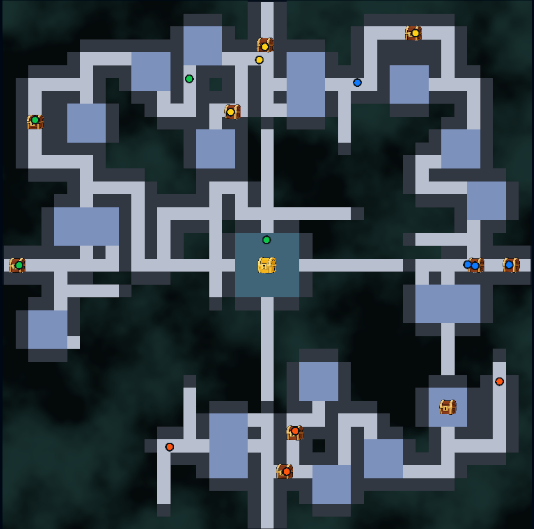
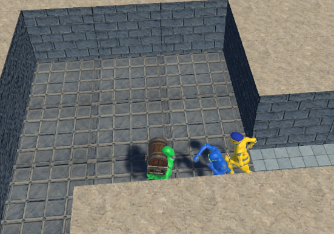
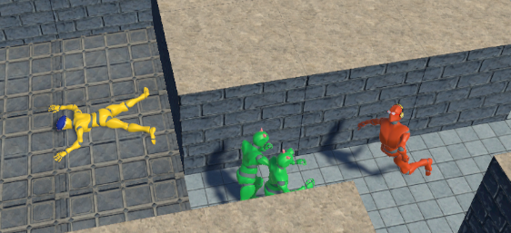

# ゲームルール

Super Dungeon Wars Programming Battle は、4つの冒険者パーティーが迷宮を探索し、宝箱を入口へ持ち帰って獲得コイン数を競うプログラミングバトルです。

参加者は、自分のパーティーが迷宮内でどのように探索し、宝箱を確保し、どの入口へ持ち帰るかをプログラムします。

## ゲームの目的

迷宮内にある宝箱を見つけ、4チームの入口のいずれかまで持ち帰ります。

宝箱を入口まで持ち帰ると、その宝箱に入っていたコインを獲得できます。

試合終了時に、持ち帰った宝箱に入っていたコインの合計が最も多いチームが勝利します。

## 試合の基本構成

1回の試合には、4つのパーティーが参加します。

各パーティーは、それぞれ異なる入口から迷宮へ入ります。入口の座標は毎回固定です。

迷宮は41×41セルの正方形のグリッドで構成されています。迷宮の構造は試合ごとに変化するため、毎回同じ経路や探索方法が有効とは限りません。

一方で、迷宮中央の部屋と4つの入口は固定位置にあります。

## 迷宮と宝箱

迷宮内には、一般の宝箱と金の宝箱があります。

### 中央の部屋

迷宮の中央には、必ず中央の部屋があります。

中央の部屋の座標は毎回同じであり、そこには必ず金の宝箱が1つ配置されます。

中央の部屋へ至るまでの迷路の構造は、試合ごとに変化します。中央の部屋の位置を知っていても、実際に到達するには通行できる経路を探索する必要があります。

### 一般の宝箱

一般の宝箱は、迷宮内に配置されます。

一般の宝箱に入っているコイン数は、金の宝箱に入っているコイン数よりも少なくなります。

### 金の宝箱

金の宝箱は、迷宮中央の部屋に必ず1つ配置されます。

金の宝箱には、一般の宝箱よりも多くのコインが入っています。

そのため金の宝箱は重要な目標ですが、中央の部屋を目指すほかのパーティーとの競争も発生します。

## 宝箱の持ち帰り

宝箱を見つけただけでは、コインを獲得できません。

宝箱を迷宮の外へ運び、4チームの入口のいずれかまで持ち帰ることで、その宝箱に入っているコインを獲得できます。

持ち帰り先は、自分のチームが試合を開始した入口に限りません。

4チームのどの入口へ持ち帰っても、自分のチームの得点になります。

入口の位置は固定されているため、宝箱を見つけた場所、迷路の構造、ほかのチームの位置に応じて、どの入口へ向かうかを判断することが重要です。

## 宝箱の運搬中

宝箱を運搬しているキャラクターは、通常よりも移動速度が遅くなります。

また、宝箱を運搬している間は攻撃できません。

宝箱を持つキャラクターは無防備になり、通常移動中の相手から追いつかれる可能性があります。宝箱を確保した後、どの経路でどの入口へ向かうか、味方がどのように守るかも重要な戦略になります。

## パーティー間の攻撃

同じ迷宮には、ほかの3チームのパーティーも参加しています。

キャラクターは、相手チームのキャラクターに隣接すると攻撃できます。

攻撃が命中したキャラクターは吹っ飛び、一定時間は行動できなくなります。

行動できなくなったキャラクターは、一定時間後に起き上がり、再び行動や攻撃ができるようになります。HPや死亡の概念はありません。

### 相打ち

両者が同時に攻撃し、互いの攻撃が命中した場合は相打ちになります。

相打ちになった場合は、双方のキャラクターが吹っ飛び、一定時間は行動できなくなります。

攻撃を仕掛ける側にも隙が生まれるため、攻撃のタイミング、味方との連携、宝箱を運ぶ仲間の護衛が重要です。

## 勝敗の決め方

試合終了時に、各チームが持ち帰った宝箱のコイン数を合計します。

最も多くのコインを獲得したチームが勝利します。

金の宝箱は高い価値を持ちますが、一般の宝箱を複数持ち帰ることでも得点を増やせます。

そのため、中央の金の宝箱を最優先で狙う戦略だけでなく、一般の宝箱を効率よく探す戦略、ほかのチームの行動に応じて目標を切り替える戦略も考えられます。

## 試合終了

試合時間は2分です。

制限時間が終了した時点で試合は終了します。

ただし、制限時間内であっても、迷宮内にあるすべての宝箱が入口へ持ち帰られた場合は、その時点で試合終了となります。

## 探索と戦略

迷宮の構造は試合ごとに変化します。

参加者は、パーティーが把握した地形や周囲の状況をもとに、探索先や行動を判断します。

たとえば、次のような戦略が考えられます。

- 中央の金の宝箱を最優先で目指す。
- 近くにある一般の宝箱を回収し、確実に得点する。
- 迷路の探索を担当するキャラクターと、宝箱を運ぶキャラクターの役割を分ける。
- 宝箱を見つけた場所から近い入口や、安全に到達しやすい入口へ運ぶ。
- 宝箱を運ぶ味方を護衛し、相手チームの攻撃を妨害する。
- 相手チームが金の宝箱を狙っている間に、一般の宝箱を集める。
- ほかのパーティーの位置や行動を見て、探索先や持ち帰り先を変更する。

どのような行動を選ぶかは、参加者が作成するプログラムによって決まります。

## 関連資料

- Unityプロジェクトの導入方法は、[はじめに](GettingStarted.md) を参照してください。
- 利用可能な関数やデータは、[APIリファレンス](APIReference.md) を参照してください。
- 提出に関する案内は、[提出ガイド](SubmissionGuide.md) を参照してください。