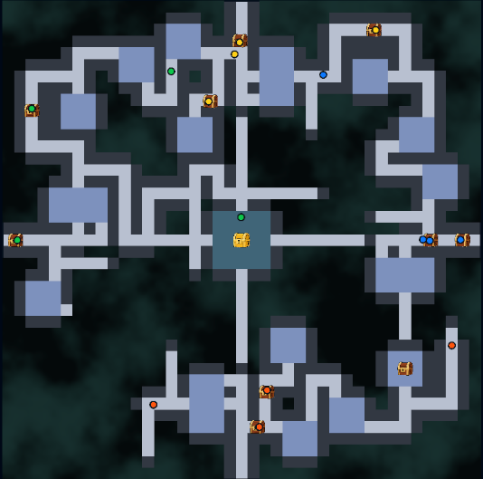
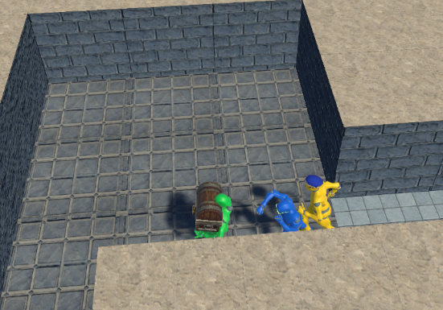
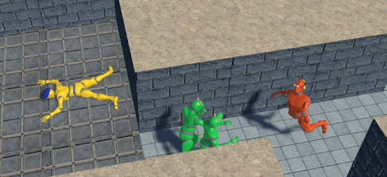

# ゲームルール

スーパーダンジョンウォーズは、4つの冒険者パーティーが迷宮を探索し、宝箱を入口へ搬出して、獲得したコインの合計を競うプログラミングバトルです。

参加者は、自分のパーティーがどこを探索し、どの宝箱を確保し、どの入口へ運ぶかをプログラムします。

## ゲームの目的

迷宮内にある宝箱を見つけ、4チームの入口のいずれかへ搬出します。

宝箱を入口へ搬出すると、その宝箱に入っていたコインを獲得できます。試合終了時に、獲得したコインの合計が最も多いチームが勝利します。

**宝箱は、発見したり所持したりするだけでは得点になりません。入口まで運び切る必要があります。**

## 試合の基本構成

1回の試合には4つのパーティーが参加し、各パーティーは4人の冒険者で構成されます。

各パーティーは、それぞれ異なる入口から迷宮へ入ります。

迷宮は41×41セルの正方形のグリッドで構成されます。4つの入口と中央の部屋の位置は固定されていますが、迷路の構造は試合ごとに変化します。

そのため、毎回同じ経路や探索方法が有効とは限りません。観測した情報をもとに、その試合の迷宮に合わせて行動を判断する必要があります。

## 迷宮と宝箱

迷宮内には、一般の宝箱と金の宝箱があります。

### 中央の部屋

迷宮の中央には、必ず中央の部屋があります。

中央の部屋の位置は毎回同じであり、そこには必ず金の宝箱が1つ配置されます。

中央の部屋へ至るまでの迷路の構造は、試合ごとに変化します。中央の部屋の位置を知っていても、実際に到達するには通行できる経路を探索する必要があります。

### 一般の宝箱

一般の宝箱は、迷宮内に配置されます。

一般の宝箱には、金の宝箱より少ないコインが入っています。一般の宝箱を複数回収することでも、得点を増やせます。

### 金の宝箱

金の宝箱は、迷宮中央の部屋に必ず1つ配置されます。

金の宝箱には、一般の宝箱より多くのコインが入っています。

重要な目標となる一方、中央の部屋を目指すほかのパーティーとの競争も発生します。

## 宝箱の持ち帰り

宝箱を拾い、4チームの入口のいずれかへ運ぶことで、宝箱を搬出できます。

**搬出先は、自分のチームが試合を開始した入口に限りません。4チームのどの入口へ搬出しても、運んだチームの得点になります。**

入口の位置は固定されています。宝箱を見つけた場所、観測した迷路の構造、ほかのチームの位置などに応じて、どの入口へ向かうかを判断することが重要です。

## 宝箱の運搬中

宝箱を運搬しているキャラクターは、通常より移動速度が遅くなります。また、運搬している間は攻撃できません。

通常移動中の相手に追いつかれる可能性があるため、運搬経路の選択や、味方による護衛が重要になります。

宝箱の確保だけでなく、入口まで安全に運ぶための行動も考えてください。

## パーティー間の攻撃

キャラクターは、隣接する相手チームのキャラクターを攻撃できます。ただし、宝箱を運搬している間は攻撃できません。

攻撃が命中したキャラクターは吹っ飛び、一定時間行動できなくなります。その後、起き上がって再び行動できるようになります。

**HPや死亡の概念はありません。** 攻撃は、相手の行動を一時的に止めるために利用します。

### 相打ち

両者が同時に攻撃し、互いの攻撃が命中した場合は相打ちになります。

相打ちになった場合は、双方のキャラクターが吹っ飛び、一定時間行動できなくなります。

攻撃を仕掛ける側も行動できなくなる可能性があるため、攻撃のタイミングや味方との連携を考えることが重要です。

## 勝敗の決め方

試合終了時に、各チームが入口へ搬出した宝箱のコインを合計します。最も多くのコインを獲得したチームが勝利します。

金の宝箱は高い価値を持ちますが、一般の宝箱を複数搬出することでも得点を増やせます。

中央の金の宝箱を優先するだけでなく、一般の宝箱を効率よく回収したり、ほかのチームの動きに応じて目標を切り替えたりする戦略も考えられます。

試合終了時に運搬中で、まだ入口へ搬出していない宝箱は得点になりません。

## 試合終了

試合時間は最大2分です。制限時間に達すると試合が終了します。

ただし、制限時間内であっても、迷宮内にあるすべての宝箱が入口へ搬出された場合は、その時点で試合が終了します。

## 探索と戦略

各パーティーは、自パーティーが観測した地形や通路などの情報を、既知マップとして利用します。

既知マップは迷宮全体の情報ではありません。未観測領域の通路や地形が判明していることを前提にせず、探索によって得られた情報をもとに行動を判断してください。

たとえば、次のような戦略が考えられます。

- 中央の金の宝箱を優先して目指します。
- 近くの一般宝箱を回収し、入口への搬出を優先します。
- 4人で探索先を分担し、迷宮の情報を集めます。
- 探索担当、運搬担当、護衛担当などの役割を分けます。
- 観測した経路を比較し、近い入口や安全に到達しやすい入口へ宝箱を運びます。
- 宝箱を運ぶ味方を護衛し、相手チームの攻撃を妨げます。
- ほかのチームが金の宝箱を狙っている間に、一般の宝箱を集めます。
- 残り時間や周囲の状況に応じて、探索先や搬出先を変更します。

どのような行動を選ぶかは、参加者が作成するプログラムによって決まります。

## 関連資料

Unityプロジェクトの導入と参加者データの作成手順は、[はじめに](GettingStarted.md) を参照してください。

利用できる関数やデータ、実装時の注意点は、[APIリファレンス](APIReference.md) を参照してください。

提出用ZIPの作成と提出方法は、[提出ガイド](SubmissionGuide.md) を参照してください。