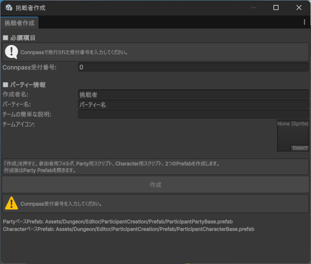
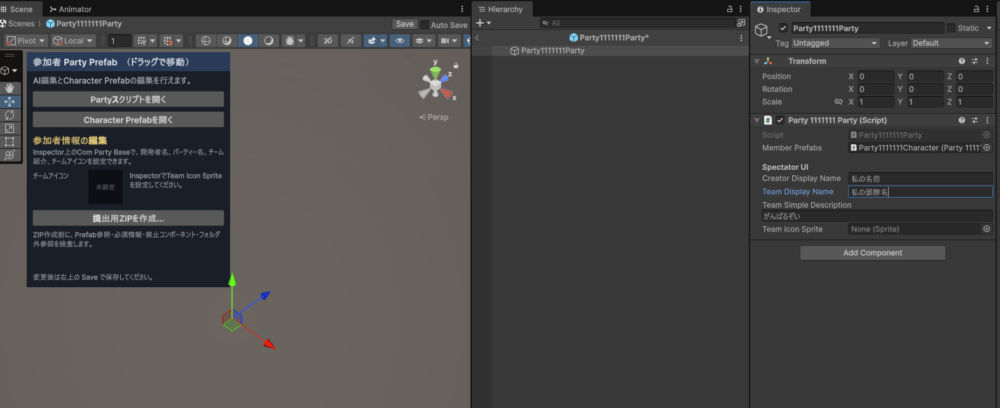
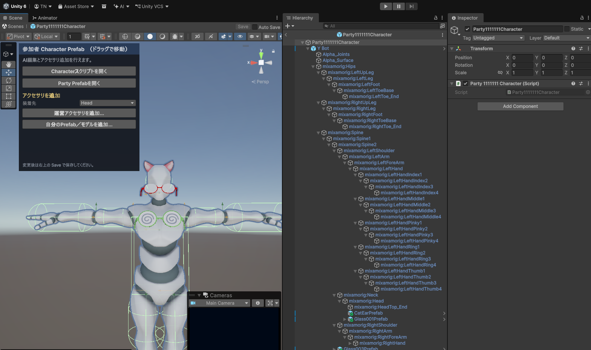
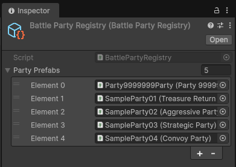
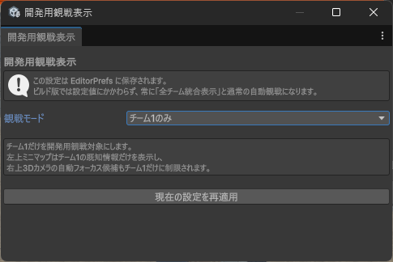
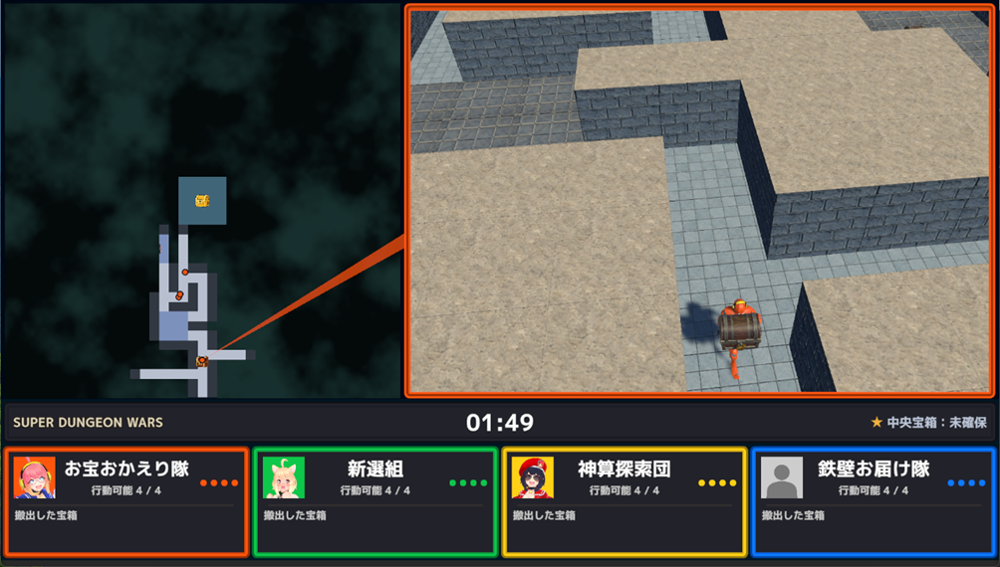

# はじめに

このページでは、Super Dungeon Wars Programming Battle のプロジェクトをUnityで開き、サンプル対戦を確認してから、自分のパーティーを作成・編集・対戦へ参加させるまでの手順を説明します。

## 必要な環境

このプロジェクトは、以下のUnityバージョンで作成されています。

```text
Unity 6000.3.24f1
```

Unity Hubから、リポジトリ内の次のフォルダをUnityプロジェクトとして開いてください。

```text
SuperDungeonWars
```

## まずサンプル対戦を確認する

最初に、あらかじめ用意されている4チームの対戦を確認してください。

Unity Editorで、次のシーンを開きます。

```text
Assets/Dungeon/Scenes/MazeExplore
```

シーンを開いたら、Unity Editor上部の再生ボタンを押してPlay Modeを開始してください。

サンプルの4チームによる対戦が始まります。

迷路の探索、宝箱の回収、宝箱を運ぶキャラクターの護衛、ほかのチームへの攻撃などを実際に見て、ゲームの流れを確認してください。

ゲームの基本ルールは、[ゲームルール](GameRules.md) を参照してください。

## 自分のパーティーを作成する

### Connpassでエントリーする

大会へ参加するには、まずConnpassの募集ページからエントリーし、Connpass受付番号を取得してください。

挑戦者作成時には、Connpassで発行された受付番号を入力します。

> [!NOTE]
> Connpassの募集ページURLと、エントリー手順の画像は後日このページへ追加します。

### 挑戦者作成画面を開く

Unity Editorのメニューバーから、次の項目を選択します。

```text
プロバト → 挑戦者作成
```

挑戦者作成画面が開きます。



### パーティー情報を入力する

挑戦者作成画面では、以下の情報を設定します。

| 項目 | 内容 |
| --- | --- |
| Connpass受付番号 | Connpassでエントリーした際に発行される受付番号です。 |
| 作成者名 | 配信や結果表示などで使用する作成者名です。 |
| パーティー名 | 作成するパーティーの名前です。 |
| チームの簡単な説明 | パーティーの戦略や特徴を紹介する短い説明です。 |
| チームアイコン | 配信や観戦画面などで使用するチームアイコンです。 |

必要事項を入力したら、`作成` ボタンを押してください。

Connpass受付番号以外の項目は、作成後も変更できます。最初は仮の内容で作成してから、後で調整しても構いません。

作成に成功すると、参加者用フォルダ、パーティー用スクリプト、キャラクター用スクリプト、パーティーPrefab、キャラクターPrefabが作成されます。

## パーティーPrefabを編集する

挑戦者の作成後、パーティーPrefabの編集画面が開きます。



パーティーPrefabでは、主にパーティー全体に関する情報とAIを編集します。

### Inspectorで設定できる情報

Inspectorでは、次の情報を変更できます。

| 項目 | 内容 |
| --- | --- |
| Creator Display Name | 作成者名です。 |
| Team Display Name | パーティー名です。 |
| Team Simple Description | チームの簡単な説明です。 |
| Team Icon Sprite | チームアイコンです。 |

変更後は、Prefab Mode上部の `Save` を押して保存してください。

### 編集画面のメニュー

パーティーPrefabの編集画面には、次のボタンがあります。

| ボタン | 内容 |
| --- | --- |
| `Partyスクリプトを開く` | パーティー全体の行動を決めるAIスクリプトを開きます。 |
| `Character Prefabを開く` | キャラクターPrefabの編集画面を開きます。 |
| `提出用ZIPを作成...` | 提出用のZIPファイルを作成します。 |

## キャラクターPrefabを編集する

`Character Prefabを開く` を押すと、キャラクターPrefabの編集画面が開きます。



キャラクターPrefabでは、キャラクター用AIスクリプトの編集と、見た目のアクセサリ追加を行えます。

### キャラクターAIを編集する

`Characterスクリプトを開く` を押すと、キャラクターごとの行動を決めるAIスクリプトを開けます。

キャラクターAIでは、たとえば以下のような個別判断を実装できます。

- 自分が向かう目的地を決める。
- 周囲の状況を見て、探索や帰還の行動を切り替える。
- 攻撃できる相手がいるときに、攻撃する相手を選ぶ。
- 宝箱を見つけたときに、拾うかどうかを判断する。

パーティー全体の判断はPartyスクリプト、キャラクター個別の判断はCharacterスクリプトに記述します。

詳細は、[APIリファレンス](APIReference.md) を参照してください。

### アクセサリを追加する

キャラクターPrefabの編集画面では、見た目をカスタマイズするアクセサリを追加できます。

運営が用意したアクセサリを使う場合は、`運営アクセサリを追加...` を選択してください。

自分で用意したアクセサリや3Dモデルを使う場合は、`自分のPrefab／モデルを追加...` を選択してください。

自作モデルを使う場合は、あらかじめ自分の参加者用フォルダ内へ、モデル、テクスチャ、マテリアルなどの必要なファイルを入れておく必要があります。

アクセサリは見た目を楽しむための要素です。キャラクターの能力、移動速度、攻撃性能などのゲーム内容には影響しません。

> [!IMPORTANT]
> アクセサリとして使用する素材は、自分で作成したもの、または利用条件を満たしているものだけを使用してください。

## AIプログラムを作成する

PartyスクリプトとCharacterスクリプトは、自由に書き換えられます。

- Partyスクリプトでは、4人全体の役割分担や移動目標を決めます。
- Characterスクリプトでは、各キャラクターの個別行動を決めます。
- 移動先は、PartyスクリプトとCharacterスクリプトのどちらからでも指示できます。
- 同じフレームで両方から移動命令を出した場合は、Characterスクリプトの命令が優先されます。

迷路の構造は試合ごとに変わるため、既知マップを使った探索、宝箱の発見、持ち帰り先の選択、味方の護衛、相手チームへの対応などを工夫してください。

プログラミングにおけるAIツールの使用に制限はありません。

## 自分のパーティーを対戦に参加させる

Unity EditorでPlay Modeを開始すると、作成したパーティーは自動的に試合へ参加します。

試合に参加する4チームは、次のデータに登録されているチームのうち、先頭から4チームです。

```text
Assets/Participants/BattlePartyRegistry
```

`BattlePartyRegistry` の登録順を変更すると、自分のパーティーを別のサンプルチームと対戦させたり、対戦相手の組み合わせを変更したりできます。



> [!NOTE]
> `BattlePartyRegistry` の設定を変更した場合は、意図した4チームが登録されていることを確認してからPlay Modeを開始してください。


## 開発用観戦表示を使う

自分のパーティーが把握している迷路情報を確認したい場合は、開発用観戦表示を利用できます。

Unity Editorのメニューバーから、次の項目を選択してください。

```text
Tools → プロバト → 開発用観戦表示
```

開発用観戦表示ウインドウが開きます。



### 観戦モードを選ぶ

観戦モードでは、次の表示方法を選択できます。

| 観戦モード | 左上のマップ表示 |
| --- | --- |
| `全チーム統合表示` | 全チームが把握している情報を統合して表示します。 |
| `チーム1のみ` | チーム1が把握している情報だけを表示します。 |
| `チーム2のみ` | チーム2が把握している情報だけを表示します。 |
| `チーム3のみ` | チーム3が把握している情報だけを表示します。 |
| `チーム4のみ` | チーム4が把握している情報だけを表示します。 |

たとえば、自分のパーティーがチーム1として参加している場合は、観戦モードを `チーム1のみ` に設定してください。

この状態でPlay Modeを開始すると、ゲーム画面左上のマップには、チーム1が実際に観測して把握している情報だけが表示されます。

未探索・未観測の領域、ほかの場所で見つかった通路、ほかのチームだけが発見した宝箱などは表示されません。



この表示を利用すると、次のような点を確認できます。

- 自分のパーティーが迷路を正しく観測できているか。
- 既知マップを使った探索処理が期待どおりに動いているか。
- 宝箱や相手チームを、想定どおりに発見できているか。
- 未観測の情報を前提とした処理になっていないか。
- 探索担当のキャラクターが増えたときに、把握できる範囲がどのように変化するか。

### 設定の反映タイミング

観戦モードの設定はUnity Editorの設定として保存されます。

通常は、Play Modeを開始すると設定が反映されます。すでにPlay Mode中の場合は、開発用観戦表示ウインドウの `現在の設定を再適用` を押すことで、現在の設定を反映できます。

### トーナメント・公開時の表示

トーナメントの公開・観戦用画面では、`全チーム統合表示` を使用します。

この表示では、左上のマップに各チームが把握している情報を統合して表示します。観戦者が試合全体の進行や、各チームの探索状況を把握しやすくするための表示です。

一方、参加者がAIを開発・検証するときは、自分のチームだけの情報を表示して確認することをおすすめします。


## 次のステップ

まずは単純な探索や宝箱の持ち帰りから実装し、少しずつ戦略を改良していくことをおすすめします。

迷路を素早く探索するパーティー、金の宝箱を狙うパーティー、一般の宝箱を効率よく回収するパーティー、宝箱の運搬役を護衛するパーティーなど、さまざまな戦略が考えられます。

自分だけの強い迷路探索パーティーを作ってみてください。

完成したパーティーの提出方法は、[提出ガイド](SubmissionGuide.md) を参照してください。