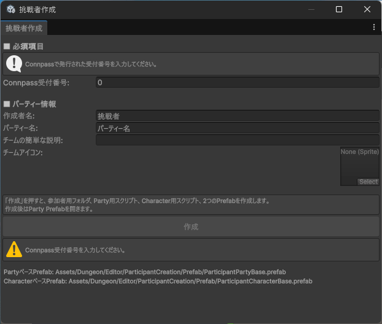
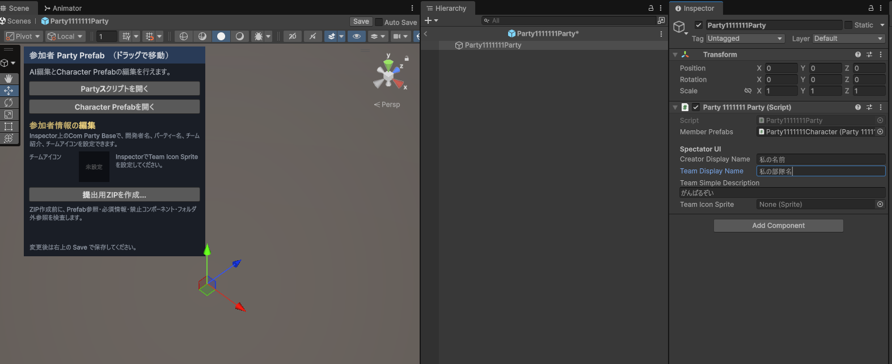
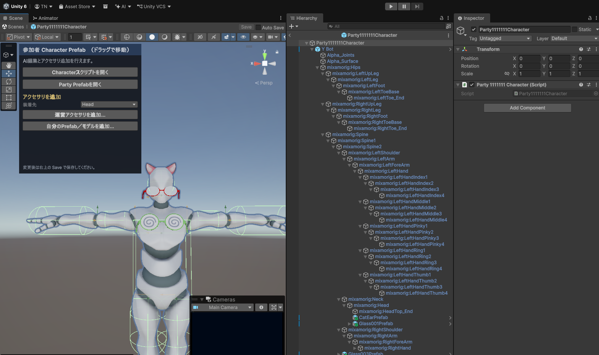
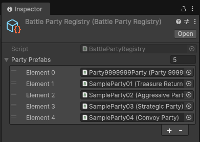
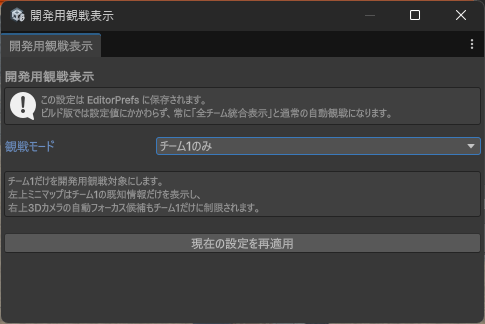
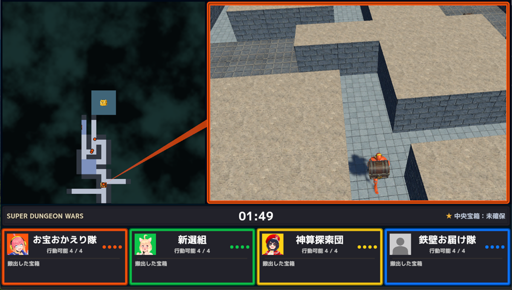

# はじめに

このページでは、スーパーダンジョンウォーズのUnityプロジェクトをダウンロードし、サンプル対戦を確認してから、自分のパーティーを作成・編集・対戦へ参加させるまでの手順を説明します。

## 💻 必要な環境

開発にはUnity Hubと、次のバージョンのUnity Editorを使用します。

```text
Unity 6000.3.24f1
```

Unity Hubから、このバージョンのUnity Editorをインストールしてください。

参加者はUnityとC#を使って、パーティーの行動をプログラムします。プログラミングにおけるAIツールの使用に制限はありません。

## 📥 プロジェクトをダウンロードして開く

### 📦 ZIPをダウンロードする

[GitHubのリポジトリ](https://github.com/SXG-xeen-Kagawa/SuperDungeonWars-ProgrammingBattle)を開き、`Code → Download ZIP` を選択してください。

ダウンロードしたZIPファイルは、任意の作業フォルダへ解凍してください。ZIPファイル内から直接プロジェクトを開かないでください。

この方法では、Gitのインストールや操作は不要です。

### 📂 Unity Hubへ登録する

Unity Hubのプロジェクト画面から、既存のプロジェクトを追加する操作を選びます。

解凍したフォルダの中にある、次のフォルダを指定してください。

```text
SuperDungeonWars
```

> [!IMPORTANT]
> Unity Hubへ登録するのは、解凍したリポジトリの最上位フォルダではなく、その中にある `SuperDungeonWars` フォルダです。
>
> 選択したフォルダの中に、`Assets`、`Packages`、`ProjectSettings` があることを確認してください。

登録したプロジェクトを、Unity `6000.3.24f1` で開いてください。

初回はアセットの読み込みなどに時間がかかることがあります。処理が完了してから、次の操作へ進んでください。

## ▶️ まずサンプル対戦を確認する

最初に、あらかじめ用意されている4チームの対戦を確認してください。

Unity Editorで、次のシーンを開きます。

```text
Assets/Dungeon/Scenes/MazeExplore
```

シーンを開いたら、Unity Editor上部の再生ボタンを押してPlay Modeを開始してください。

サンプルの4チームによる対戦が始まります。

迷路の探索、宝箱の回収、宝箱を運ぶキャラクターの護衛、ほかのチームへの攻撃などを見て、ゲームの流れを確認してください。

ゲームの基本ルールは、[ゲームルール](GameRules.md)を参照してください。

対戦を確認したら、再生ボタンをもう一度押してPlay Modeを終了し、自分のパーティーの作成へ進みます。

## 🧑‍💻 自分のパーティーを作成する

### 📝 connpassでエントリーする

大会へ参加するには、[connpassの募集ページ](https://connpass.com/event/407970/)からエントリーし、connpass受付番号を取得してください。

挑戦者作成時には、connpassで発行された受付番号を入力します。

開催日、提出締切などの大会に関する情報は、募集ページで確認してください。

### 🛠️ 挑戦者作成画面を開く

Unity Editorのメニューバーから、次の項目を選択します。

```text
プロバト → 挑戦者作成
```

挑戦者作成画面が開きます。



### 🪪 パーティー情報を入力する

挑戦者作成画面では、以下の情報を設定します。

| 項目 | 内容 |
|---|---|
| Connpass受付番号 | connpassでエントリーした際に発行される受付番号です。 |
| 作成者名 | 配信や結果表示などで使用する作成者名です。 |
| パーティー名 | 作成するパーティーの名前です。 |
| チームの簡単な説明 | パーティーの戦略や特徴を紹介する短い説明です。 |
| チームアイコン | 配信や観戦画面などで使用するチームアイコンです。 |

必要事項を入力したら、`作成` ボタンを押してください。

connpass受付番号以外の項目は、作成後も変更できます。最初は仮の内容で作成してから、後で調整しても構いません。

作成に成功すると、参加者用フォルダ、Partyスクリプト、Characterスクリプト、パーティーPrefab、キャラクターPrefabが作成されます。

## 👥 パーティーPrefabを編集する

挑戦者の作成後、パーティーPrefabの編集画面が開きます。

Prefabは、ゲーム内で使用するオブジェクトの構成や設定を保存したアセットです。



パーティーPrefabでは、主にパーティー全体に関する情報とAIを編集します。

### ⚙️ Inspectorで設定できる情報

Inspectorでは、次の情報を変更できます。

| 項目 | 内容 |
|---|---|
| 制作者名 | 配信や結果表示などで使用する作成者名です。 |
| 所属（学校・団体名） | 制作者の所属です。任意で入力できます。 |
| パーティー名 | 作成するパーティーの名前です。 |
| パーティーの紹介 | パーティーの戦略や特徴を紹介する短い説明です。 |
| パーティーアイコン | 配信や観戦画面などで使用するアイコンです。 |

パーティーアイコンには、`Assets/Dungeon/GameAssets/Icons/` に用意されたサンプル画像を割り当てられます。

自分で用意した画像を使用する場合は、その画像を自分の参加者用フォルダ内に配置してから、パーティーアイコンに設定してください。フォルダ外の自作画像を参照したまま提出することはできません。

設定を変更したら、Prefab Mode上部の **Save** を押して保存してください。

### 🧰 編集画面のメニュー

パーティーPrefabの編集画面には、次のボタンがあります。

| ボタン | 内容 |
|---|---|
| `Partyスクリプトを開く` | パーティー全体の行動を決めるAIスクリプトを開きます。 |
| `Character Prefabを開く` | キャラクターPrefabの編集画面を開きます。 |
| `提出用ZIPを作成...` | 提出用のZIPファイルを作成します。 |

## 🧍 キャラクターPrefabを編集する

`Character Prefabを開く` を押すと、キャラクターPrefabの編集画面が開きます。



キャラクターPrefabでは、Characterスクリプトの編集と、見た目のアクセサリ追加を行えます。

### 🧠 キャラクターAIを編集する

`Characterスクリプトを開く` を押すと、各キャラクターの行動を決めるAIスクリプトを開けます。

キャラクターAIでは、たとえば以下のような個別判断を実装できます。

- 自分が向かう目的地を決めます。
- 周囲の状況を見て、探索や宝箱の搬出へ向かう行動を切り替えます。
- 攻撃できる相手がいるときに、攻撃する相手を選びます。
- 宝箱を見つけたときに、拾うかどうかを判断します。

パーティー全体の判断はPartyスクリプト、キャラクター個別の判断はCharacterスクリプトに記述します。

利用できる関数やデータの詳細は、[APIリファレンス](APIReference.md)を参照してください。

### 🎨 アクセサリを追加する

キャラクターPrefabの編集画面では、見た目をカスタマイズするアクセサリを追加できます。

運営が用意したアクセサリを使う場合は、`運営アクセサリを追加...` を選択してください。

自分で用意したアクセサリや3Dモデルを使う場合は、`自分のPrefab／モデルを追加...` を選択してください。

自作モデルを使う場合は、あらかじめ自分の参加者用フォルダ内へ、モデル、テクスチャ、マテリアルなどの必要なファイルを入れてください。

アクセサリは見た目を楽しむための要素です。キャラクターの能力、移動速度、攻撃性能には影響しません。

変更後は、Prefab Mode上部の **Save** を押して保存してください。

> [!IMPORTANT]
> アイコンやアクセサリなどに使用する素材は、自分で作成したもの、または利用条件を満たしているものだけを使用してください。第三者の権利を侵害する素材は使用できません。

## 💡 AIプログラムを作成する

PartyスクリプトとCharacterスクリプトを編集し、自分の戦略を実装します。

| スクリプト | 主な役割 |
|---|---|
| Partyスクリプト | 4人全体の役割分担や、各メンバーの移動目標を決めます。 |
| Characterスクリプト | 各キャラクターの状態に応じた個別行動を決めます。 |

移動先は、どちらのスクリプトからでも指示できます。

> [!IMPORTANT]
> 同一フレームでは、Partyの `SXG_OnPartyThink()` が先に、Characterの `SXG_OnCharacterThink()` が後に呼ばれます。
>
> 両方から同じキャラクターへ移動命令を出した場合は、Characterスクリプト側の命令が優先されます。Partyスクリプトで設定した目標を、意図せず上書きしないようにしてください。

迷路の構造は試合ごとに変わります。自パーティーが観測した既知マップを使い、探索、宝箱の回収、搬出先の選択、味方の護衛、相手チームへの対応などを工夫してください。

宝箱は、自チームの入口だけでなく、4チームのどの入口へ搬出しても、運んだチームの得点になります。

**プログラミングにおけるAIツールの使用に制限はありません。**

実装時は、[APIリファレンス](APIReference.md)と[ゲームルール](GameRules.md)を参照してください。

## ⚔️ 自分のパーティーを対戦に参加させる

作成したパーティーは、Play Modeを開始すると自動的に試合へ参加します。

対戦に使用するシーンは、サンプル対戦と同じです。

```text
Assets/Dungeon/Scenes/MazeExplore
```

試合に参加する4チームは、次のデータに登録されているチームのうち、先頭から4チームです。

```text
Assets/Participants/BattlePartyRegistry
```

`BattlePartyRegistry` の登録順を変更すると、自分のパーティーを別のサンプルチームと対戦させたり、対戦相手の組み合わせを変更したりできます。



> [!NOTE]
> 試合に参加するのは、登録されているチームの先頭4チームです。
> 自分のパーティーが参加しない場合や、登録順を変更した場合は、先頭4チームが意図した組み合わせになっているかを確認してください。

### ⏩ 開発用TIPS：試合の実行速度を上げる

試合中にキーボードの **Shift + ↑** を押すと、実行速度を速められます。

AIの動作確認や、試合結果を繰り返し確認するときに利用してください。

## 🔍 開発用観戦表示を使う

自分のパーティーが把握している迷路情報を確認したい場合は、開発用観戦表示を利用できます。

Unity Editorのメニューバーから、次の項目を選択してください。

```text
Tools → プロバト → 開発用観戦表示
```

開発用観戦表示ウインドウが開きます。



### 🗺️ 観戦モードを選ぶ

観戦モードでは、次の表示方法を選択できます。

| 観戦モード | 左上のマップ表示 |
|---|---|
| `全チーム統合表示` | 全チームが把握している情報を統合して表示します。 |
| `チーム1のみ` | チーム1が把握している情報だけを表示します。 |
| `チーム2のみ` | チーム2が把握している情報だけを表示します。 |
| `チーム3のみ` | チーム3が把握している情報だけを表示します。 |
| `チーム4のみ` | チーム4が把握している情報だけを表示します。 |

たとえば、自分のパーティーがチーム1として参加している場合は、観戦モードを `チーム1のみ` に設定してください。

この状態でPlay Modeを開始すると、ゲーム画面左上のマップには、チーム1が実際に観測して把握している情報だけが表示されます。

自チームがまだ観測していない領域や通路、ほかのチームだけが発見した宝箱などは表示されません。



この表示を利用すると、次のような点を確認できます。

- 自分のパーティーが迷路を期待どおりに観測できているかを確認できます。
- 既知マップを使った探索処理が期待どおりに動いているかを確認できます。
- 宝箱や相手チームを、想定どおりに発見できているかを確認できます。
- 未観測の情報を前提とした処理になっていないかを確認できます。
- 探索担当のキャラクターを増やしたときに、把握できる範囲がどのように変化するかを確認できます。

### 🔄 設定の反映タイミング

観戦モードの設定は、Unity Editorの設定として保存されます。

通常は、Play Modeを開始すると設定が反映されます。

すでにPlay Mode中の場合は、開発用観戦表示ウインドウの `現在の設定を再適用` を押してください。

### 📺 トーナメント・公開時の表示

トーナメントの公開・観戦用画面では、`全チーム統合表示` を使用します。

この表示では、左上のマップに各チームが把握している情報を統合して表示します。観戦者が試合全体の進行や、各チームの探索状況を把握しやすくするための表示です。

全チーム統合表示で見える情報が、すべて自パーティーの既知マップに含まれているわけではありません。

AIを開発・検証するときは、自分のチームだけの情報を表示して確認することをおすすめします。

## 🧭 次のステップ

まずは単純な探索や宝箱の搬出から実装し、対戦で動作を確認しながら、少しずつ戦略を改良していくことをおすすめします。

迷路を素早く探索するパーティー、中央の金の宝箱を狙うパーティー、一般の宝箱を効率よく回収するパーティー、宝箱の運搬役を護衛するパーティーなど、さまざまな戦略が考えられます。

完成したら、パーティーPrefabとキャラクターPrefabを保存し、パーティーPrefabの `提出用ZIPを作成...` から提出用ZIPを出力してください。

出力時に問題が表示された場合は、内容を修正してから再度出力してください。

提出するのは、この機能で作成したZIPファイルです。Unityプロジェクト全体を提出する必要はありません。

**提出先・提出方法は後日、[connpassのイベントページ](https://connpass.com/event/407970/)でお知らせします。** 出力したZIPは、解凍せず、中身を変更せずに、提出先の発表まで保管してください。

提出先の発表後、案内する方法に従って、**2026年11月8日（日）23:59までに**提出してください。

> [!IMPORTANT]
> **connpassへのエントリーや提出用ZIPの出力だけでは、作品応募は完了しません。**
> 後日案内する方法で、締切までに提出用ZIPを実際に提出してください。

詳しい出力手順と提出の案内は、[提出ガイド](SubmissionGuide.md)を参照してください。