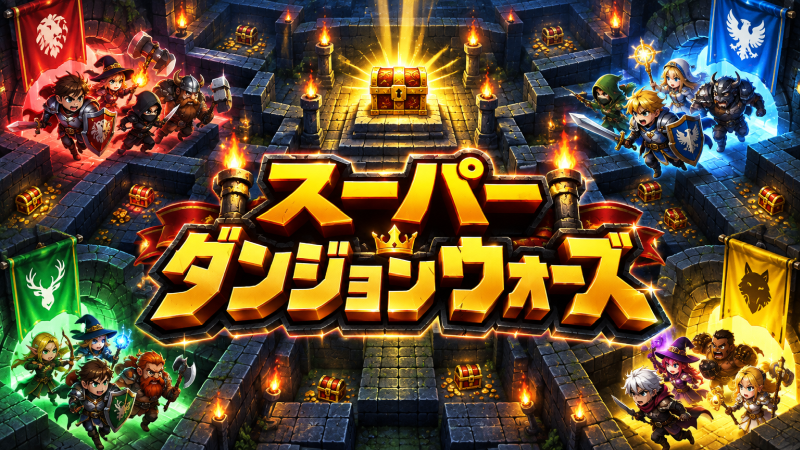

# Super Dungeon Wars Programming Battle

<p align="center">
  
</p>

自分でプログラムした冒険者パーティーをダンジョンへ送り込み、宝箱の持ち帰りを競うプログラミングバトルです。

参加者は、4人のキャラクターの行動を設計します。自分で作ったパーティーが迷宮を探索し、宝箱を運び、ほかのパーティーと競い合う様子を楽しめます。

## 概要

Super Dungeon Wars Programming Battle は、4つの冒険者パーティーが同じ迷宮を探索し、宝箱を持ち帰って獲得コイン数を競うゲームです。

迷宮の中央には、一般の宝箱より多くのコインが入った金の宝箱が必ず配置されます。一般の宝箱も迷宮内に配置されます。

宝箱は、自分たちの入口に限らず、4チームのいずれかの入口へ持ち帰ることで得点になります。試合終了時に、獲得コイン数が最も多いチームの勝利です。

## ゲームの特徴

- 4チームが、それぞれ異なる入口から同じ迷宮へ進入します。
- 迷宮は41×41セルです。4つの入口と中央の部屋の位置は固定ですが、迷路の構造は試合ごとに変化します。
- 中央の部屋には金の宝箱が必ず1つ配置され、迷宮内には一般の宝箱も配置されます。
- 宝箱は4チームのどの入口へ持ち帰っても、運んだチームの得点になります。
- キャラクターは、隣接する相手チームのキャラクターを攻撃できます。
- 宝箱を運搬中のキャラクターは移動速度が遅くなり、かつ、攻撃できません。
- 試合時間は最大2分間です。すべての宝箱が持ち帰られた場合は、時間内でも試合が終了します。

## 参加者が作るもの

参加者は、ゲーム内で動作する4人の冒険者パーティーを作成し、パーティー全体と各キャラクターの行動をプログラムします。

探索先や役割分担、金の宝箱と一般の宝箱のどちらを狙うか、宝箱をどの入口へ運ぶか、相手チームにどう対応するかなどを判断します。

細かな移動操作そのものではなく、「どこへ向かうか」「何を優先するか」という判断をプログラムで組み立てることを重視しています。

パーティーには、制作者名、パーティー名、紹介文、アイコンを設定できます。所属（学校・団体名）は任意で設定できます。アイコンには `Assets/Dungeon/GameAssets/Icons/` のサンプル画像を自由に使用できます。自分で用意した画像を使う場合は、自分の参加者用フォルダ内に配置してください。

作成と設定の手順は、[はじめに](Documents/GettingStarted.md)を参照してください。

## 勝敗の決まり方

試合終了時に、各チームが入口へ持ち帰った宝箱のコイン数を合計します。最も多くのコインを獲得したチームが勝利します。

中央の金の宝箱は価値の高い目標です。一方で、一般の宝箱を効率よく集めたり、ほかのチームの動きを見て目標を切り替えたりする戦略も考えられます。

詳しいルールは、[ゲームルール](Documents/GameRules.md)を参照してください。

## 開発環境

このプロジェクトは **Unity 6000.3.24f1** で作成されています。

Unity Hubから、リポジトリ内の `SuperDungeonWars` フォルダをUnityプロジェクトとして開いてください。導入手順の詳細は、[はじめに](Documents/GettingStarted.md)を参照してください。

## ドキュメント

参加前に、以下の資料を確認してください。

- [ゲームルール](Documents/GameRules.md)：迷宮、宝箱、戦闘、勝敗のルールを説明します。
- [はじめに](Documents/GettingStarted.md)：Unityでの導入、パーティーの作成、動作確認の手順を説明します。
- [APIリファレンス](Documents/APIReference.md)：パーティーAIとキャラクターAIで利用できる機能を説明します。
- [提出ガイド](Documents/SubmissionGuide.md)：提出用ZIPの作成と提出方法を説明します。

> [!IMPORTANT]
> 提出期限や大会運営に関する条件は、connpassの募集ページと提出時の案内をご確認ください。ゲーム仕様やAPIなどの記載は、開発状況に応じて更新される場合があります。

## リポジトリ構成

```text
SuperDungeonWars-ProgrammingBattle/
├─ Documents/
│  ├─ Images/
│  │  └─ SuperDungeonWarsLogo.png
│  ├─ GameRules.md
│  ├─ GettingStarted.md
│  ├─ APIReference.md
│  └─ SubmissionGuide.md
├─ SuperDungeonWars/
│  ├─ Assets/
│  ├─ Packages/
│  └─ ProjectSettings/
├─ README.md
└─ .gitignore
```

## 参加・提出の案内

大会への参加方法や募集に関する情報は、connpassの募集ページをご確認ください。

https://connpass.com/event/407970/

完成したパーティーの提出方法は、[提出ガイド](Documents/SubmissionGuide.md)をご確認ください。提出先は次のGoogleフォームです。

https://forms.gle/js5Tf4DPDRQhCrNP6

提出期限や差し替えに関する条件は、募集ページおよび提出時の案内をご確認ください。