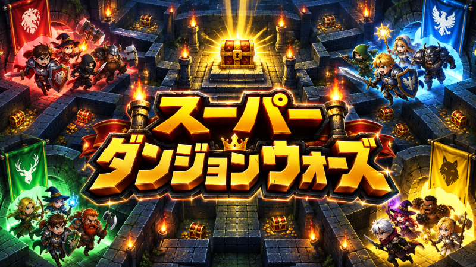

# SXG2026 プログラミングバトル<br>～スーパーダンジョンウォーズ～

<p align="center">
  
</p>

自分でプログラムした冒険者パーティーをダンジョンへ送り込み、宝箱の持ち帰りを競うプログラミングバトルです。

4人のキャラクターの行動を設計し、迷宮の探索、宝箱の運搬、仲間の護衛、相手チームへの攻撃などを組み合わせて、自分だけの戦略を作ってみましょう。

## 📌 概要

本リポジトリは、**SXG2026**で開催する「スーパーダンジョンウォーズ」プログラミングバトルの参加者向けUnityプロジェクトです。

参加者は、UnityとC#を使って4人の冒険者パーティーを作成し、その行動をプログラムします。完成したパーティーを提出いただき、イベント当日に集まったパーティーで対戦を行います。

1試合では、4つのパーティーが同じ迷宮を探索します。宝箱を入口へ持ち帰ってコインを獲得し、試合終了時に最も多くのコインを獲得したチームが勝利します。

詳しいルールは、[ゲームルール](Documents/GameRules.md)をご確認ください。募集日程とエントリー・提出先は、このページの[参加・提出の案内](#-参加提出の案内)にまとめています。

## 📥 まずはここから：ダウンロードと起動

制作には **Unity 6000.3.24f1** を使用してください。

1. 以下のリンクから、本リポジトリのページを開きます。
2. ページ上部の **Code → Download ZIP** を選び、プロジェクトをダウンロードします。
3. ダウンロードしたZIPを、自分のPCで解凍します。
4. Unity Hubで、解凍したフォルダ内の **`SuperDungeonWars`** フォルダをUnityプロジェクトとして登録します。
5. **Unity 6000.3.24f1** でプロジェクトを開きます。

[**スーパーダンジョンウォーズのUnityプロジェクトを取得する（GitHub）**](https://github.com/SXG-xeen-Kagawa/SuperDungeonWars-ProgrammingBattle/)

> [!IMPORTANT]
> Unity Hubで開くのは、ダウンロードしたフォルダ全体ではなく、その中の **`SuperDungeonWars`** フォルダです。
> `Assets`、`Packages`、`ProjectSettings` が入っているフォルダを選んでください。

プロジェクトを開いたら、次のシーンを開き、Unity Editor上部の再生ボタンを押してください。

```text
Assets/Dungeon/Scenes/MazeExplore
```

あらかじめ用意されている4チームのサンプル対戦が始まります。

パーティーの作成や編集、動作確認の詳しい手順は、[はじめに](Documents/GettingStarted.md)をご確認ください。

> **Gitで取得する場合（任意）**
>
> Gitに慣れている方は、このリポジトリをCloneして取得することもできます。
> ZIPでダウンロードする場合、Gitのインストールや操作は不要です。

## 💻 開発環境

| 項目 | 内容 |
|---|---|
| Unityバージョン | **Unity 6000.3.24f1** を使用してください。 |
| プログラミング言語 | C#でパーティーとキャラクターの行動を実装します。 |
| Unityプロジェクトのフォルダ | リポジトリ内の `SuperDungeonWars` です。 |
| サンプル対戦のシーン | `Assets/Dungeon/Scenes/MazeExplore` を開いてください。 |

## 🧭 制作から提出までの流れ

1. [募集ページ（connpass）](https://connpass.com/event/407970/)からエントリーし、受付番号を確認します。
2. Unityプロジェクトをダウンロードし、サンプル対戦で動作を確認します。
3. Unity Editorの **「プロバト → 挑戦者作成」** を開き、受付番号を入力して自分のパーティーを作成します。
4. パーティーとキャラクターのAIを編集し、対戦で動きを確認しながら戦略を改良します。
5. パーティーPrefabとキャラクターPrefabの変更を保存します。
6. パーティーPrefabの編集画面で **「提出用ZIPを作成...」** を押し、提出用ZIPを出力します。
7. 出力したZIPを、提出締め切りまでに[提出フォーム（Googleフォーム）](https://forms.gle/js5Tf4DPDRQhCrNP6)から提出します。

作成と動作確認は、[はじめに](Documents/GettingStarted.md)を参照してください。

ZIPの出力と提出は、[提出ガイド](Documents/SubmissionGuide.md)を参照してください。

## ⚔️ ゲームの特徴

- 4チームが、それぞれ異なる入口から同じ迷宮へ進入します。
- 迷宮は41×41セルです。4つの入口と中央の部屋の位置は固定ですが、迷路の構造は試合ごとに変化します。
- 中央の部屋には金の宝箱が必ず1つ配置され、迷宮内には一般の宝箱も配置されます。
- 宝箱は、自分たちの入口に限らず、4チームのどの入口へ持ち帰っても、運んだチームの得点になります。
- キャラクターは、隣接する相手チームのキャラクターを攻撃できます。
- 宝箱を運搬中のキャラクターは移動速度が遅くなり、攻撃できません。
- 試合時間は最大2分間です。すべての宝箱が持ち帰られた場合は、時間内でも試合が終了します。

## 🧑‍💻 参加者が作るもの

参加者は、4人の冒険者で構成されたパーティーと、その行動を決めるAIを作成します。

AIは、主に次の2つに分かれています。

| AI | 役割 |
|---|---|
| パーティーAI | 4人全体の役割分担や、各メンバーの移動目標を判断します。 |
| キャラクターAI | 各キャラクターの個別行動、攻撃対象、宝箱を拾うかどうかなどを判断します。 |

探索先や役割分担、金の宝箱と一般の宝箱のどちらを狙うか、どの入口へ運ぶか、相手チームにどう対応するかなどを工夫してください。

細かな移動操作そのものではなく、**「どこへ向かうか」「何を優先するか」という判断をプログラムで組み立てること**を重視しています。

利用できる機能と実装方法は、[APIリファレンス](Documents/APIReference.md)をご確認ください。

### 🎨 パーティー情報と見た目の設定

パーティーには、制作者名、パーティー名、紹介文、アイコンを設定できます。所属（学校・団体名）は任意で設定できます。

アイコンには、`Assets/Dungeon/GameAssets/Icons/` のサンプル画像を自由に使用できます。自分で用意した画像を使う場合は、自分の参加者用フォルダ内に配置してください。

キャラクターには、運営が用意したアクセサリや、自分で用意したモデルを追加できます。アクセサリは見た目を楽しむための要素で、キャラクターの能力や移動速度、攻撃性能には影響しません。

自作素材を使用する場合は、モデル、テクスチャ、マテリアルなどの必要なファイルを、自分の参加者用フォルダ内に揃えてください。

設定と編集の手順は、[はじめに](Documents/GettingStarted.md)を参照してください。

## 🏆 勝敗の決まり方

試合終了時に、各チームが入口へ持ち帰った宝箱のコイン数を合計します。最も多くのコインを獲得したチームが勝利します。

**宝箱を見つけたり、持っていたりするだけでは得点になりません。入口まで持ち帰る必要があります。**

中央の金の宝箱には、一般の宝箱より多くのコインが入っています。一方で、一般の宝箱を効率よく集めたり、ほかのチームの動きを見て目標を切り替えたりする戦略も考えられます。

詳しいルールは、[ゲームルール](Documents/GameRules.md)を参照してください。

## 📚 ドキュメント

| ドキュメント | 内容 |
|---|---|
| [はじめに](Documents/GettingStarted.md) | Unityでの導入、パーティーの作成・編集、動作確認の手順を説明します。 |
| [ゲームルール](Documents/GameRules.md) | 迷宮、宝箱、攻撃、得点、試合終了のルールを説明します。 |
| [APIリファレンス](Documents/APIReference.md) | パーティーAIとキャラクターAIで利用できる機能を説明します。 |
| [提出ガイド](Documents/SubmissionGuide.md) | 提出前の確認、提出用ZIPの作成、提出方法を説明します。 |

## 🗂️ リポジトリ構成

```text
SuperDungeonWars-ProgrammingBattle/
├─ Documents/
│  ├─ Images/
│  │  └─ SuperDungeonWarsLogo.png
│  ├─ GameOverview.md
│  ├─ GameRules.md
│  ├─ GettingStarted.md
│  ├─ APIReference.md
│  └─ SubmissionGuide.md
├─ SuperDungeonWars/
│  ├─ Assets/
│  ├─ Packages/
│  └─ ProjectSettings/
├─ README.md
└─ .gitignore
```

`Documents/Images/` には、ロゴと各ドキュメントのスクリーンショットを配置しています。

## 📅 参加・提出の案内

### 🗓️ 募集日程

| 項目 | 日程 |
|---|---|
| 募集開始 | **2026年10月1日（木）** |
| イベント開催予定 | **2026年11月15日（日）** |
| 提出締め切り | **2026年11月8日（日）23:59** |

### 📝 エントリー

大会への参加は、以下のconnpass募集ページからエントリーしてください。

[**SXG2026 スーパーダンジョンウォーズにエントリーする（connpass）**](https://connpass.com/event/407970/)

エントリー後に発行される受付番号を、Unity Editorの **「プロバト → 挑戦者作成」** で入力し、自分のパーティーを作成してください。

イベントの詳しい案内は、connpass募集ページをご確認ください。

### 📤 パーティーの提出

完成したパーティーは、パーティーPrefabの **「提出用ZIPを作成...」** から提出用ZIPを出力し、**2026年11月8日（日）23:59までに**、以下のフォームから提出してください。

[**完成したパーティーを提出する（Googleフォーム）**](https://forms.gle/js5Tf4DPDRQhCrNP6)

> [!IMPORTANT]
> **connpassでのエントリーだけでは、パーティーの提出は完了しません。**
> 専用機能で出力した提出用ZIPを、提出フォームから送信してください。
> Unityプロジェクト全体を提出する必要はありません。
> 出力したZIPは、中身を編集せず、解凍せずにそのまま添付してください。

提出後は、フォームの送信完了画面を確認してください。

再提出・差し替えに関する条件は、connpass募集ページと提出フォームの案内をご確認ください。

提出前の確認事項と詳しい操作は、[提出ガイド](Documents/SubmissionGuide.md)を参照してください。

## ❓ お問い合わせ

参加方法、制作、提出に関する不明点は、[connpass募集ページ](https://connpass.com/event/407970/)からお問い合わせください。

制作中の問題については、使用しているUnityのバージョン、問題が起きる手順、Unity Consoleのエラー内容、画面のスクリーンショットを添えると確認がスムーズです。